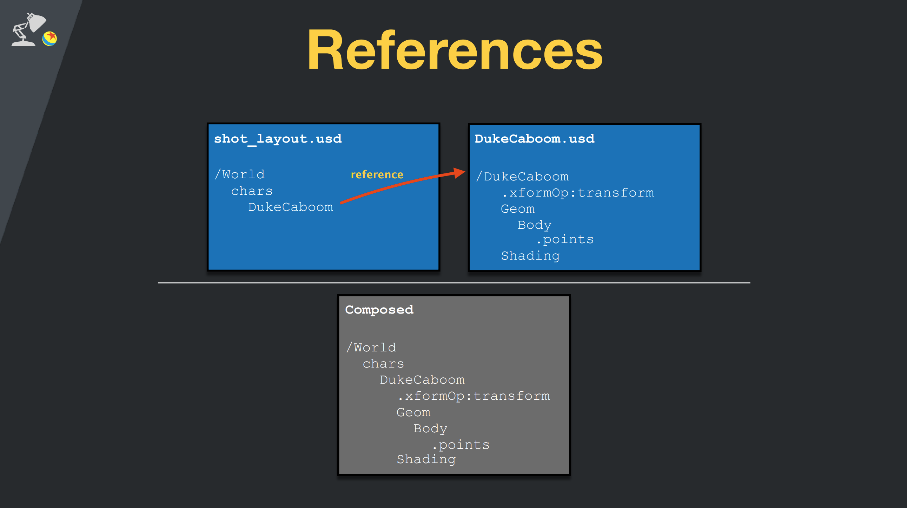

<style scoped>
section {
  text-align: center;
  font-color: white
}
</style>

# Universal Scene Description

通用场景描述


---


---
# 什么是 USD？

- USD 是一种可扩展的场景描述和文件格式
- 3D 数据交换，流程管理的框架
- 面向大规模制作，云协作，者是类似于元宇宙场景。例如 nVidia omiverse
- USD 提供了一套标准，软件通过这个中转站来交换数据，完成流程的协作


---
# USD 的历史

usd 最早来自于 pixar 公司，应用于 maya 的动画流程。
后来在 2016 年开源，逐渐成为行业公认的面向未来的，数据和流程解决方案。
由于开源属性，任何人都可以开发应用插件来扩展 usd 的功能。
- https://openusd.org/release/intro.html


---


---

# USD 的优势

- 快速加载和回放大数据集
- 非破坏编辑流程，方有利于团队协作
- 可扩展的公共语言，使得数据可以在不同应用软件之间传递


---
## 举例：速加载和回放大数据集

场景越大，优势越明显，得益于多线程加载和零拷贝机制。
下面是两个场景之间的加载对比
<table>
    <tr>
        <td width="20%">
            <table>
                <tr>
                    <td align="left"> </td>
                    <td align="left">maya</td>
                    <td align="left">usd</td>
                </tr>
                <tr>
                    <td align="left">加载时间</td>
                    <td align="left">54 s</td>
                    <td align="left">3 s</td>
                </tr>
                <tr>
                    <td align="left">性能</td>
                    <td align="left">9 fps</td>
                    <td align="left">60 fps</td>
                </tr>
                <tr>
                    <td align="left">内存</td>
                    <td align="left">4.1 GB</td>
                    <td align="left">160 MB</td>
                </tr>
            </table>
        </td>
        <td width="40%" height="100%">
            
        </td>
        <td width="40%" height="100%">
            
        </td>
    </tr>
</table>


---

# USD 文件

- usd 文件通常被成为 layer。
- 文件可以存储类似 `mesh` `light` `shader` `camera` 等信息
- usd文件扩展名有 `usd` `usdc` `usda` `usdz`


---

## .usda 文件内容 


```usd
#usda 1.0
(
    defaultPrim = "GEO"
    metersPerUnit = 0.01
    upAxis = "Y"
)

def Scope "GEO" (
    kind = "component"
)
{
    def Xform "GEO"
    {
        def Mesh "pCube1" (
            prepend apiSchemas = ["MaterialBindingAPI"]
        )
        {
            uniform bool doubleSided = 1
            float3[] extent = [(-0.5, -0.5, -0.5), (0.5, 0.5, 0.5)]
            int[] faceVertexCounts = [4, 4, 4, 4, 4, 4]
            int[] faceVertexIndices = [0, 1, 3, 2, 2, 3, 5, 4, 4, 5, 7, 6, 6, 7, 1, 0, 1, 7, 5, 3, 6, 0, 2, 4]
            rel material:binding = </GEO/mtl/initialShadingGroup>
            point3f[] points = [(-0.5, -0.5, 0.5), (0.5, -0.5, 0.5), (-0.5, 0.5, 0.5), (0.5, 0.5, 0.5), (-0.5, 0.5, -0.5), (0.5, 0.5, -0.5), (-0.5, -0.5, -0.5), (0.5, -0.5, -0.5)]
            texCoord2f[] primvars:st = [(0.375, 0), (0.625, 0), (0.375, 0.25), (0.625, 0.25), (0.375, 0.5), (0.625, 0.5), (0.375, 0.75), (0.625, 0.75), (0.375, 1), (0.625, 1), (0.875, 0), (0.875, 0.25), (0.125, 0), (0.125, 0.25)] (
                customData = {
                    dictionary Maya = {
                        token name = "map1"
                    }
                }
                interpolation = "faceVarying"
            )
            int[] primvars:st:indices = [0, 1, 3, 2, 2, 3, 5, 4, 4, 5, 7, 6, 6, 7, 9, 8, 1, 10, 11, 3, 12, 0, 2, 13]

```


[USD Terms and Concepts](https://openusd.org/release/glossary.html#)

---

# .usda 文件内容


<div class="grid grid-cols-2 gap-4">

<div>

## 文件`box.usda`
```cpp
#usda 1.0

def Cube "box" (kind = "component")
{
    double size = 4.0
}
```
</div>


<div>

## 代码解释

- 这里[def](https://openusd.org/release/glossary.html#def)是USD的关键字：用来告诉USD，我们这里定义了一个基础容器[prim](https://openusd.org/release/glossary.html#usdglossary-prim)
- 这里[prim](https://openusd.org/release/glossary.html#usdglossary-prim)是USD中的最重要的概念，是primary的缩写。它可以包含其他prim，创建命名空间层级结构。
- Cube是prim的类型，这个是由[schema](https://openusd.org/release/glossary.html#usdglossary-schema)描述的。
- 我们定义了一个属性 size，它的值是2.0。在usd中属性的值称为[opinion](https://openusd.org/release/glossary.html#direct-opinion) 


</div>
</div>

---


---

## 文件`sphere.usda`
```cpp
#usda 1.0
def Xform "GEO" 
{
    def Mesh "pSphere1"
    {
        double size = 4.0
    }
}
# prim路径为 /GEO/pSphere1
```

>这里路径指的是场景(stage)中的层次结构


---
# 层的引用(References)


```cpp
#usda 1.0
def "World"
{
    def M"box" (references=@./box_geo.usda@) {
    }
}
```

文件`box_geo.usda`，通过 [references](https://openusd.org/release/glossary.html#usdglossary-references)合成了一个场景，引用方法是[composition arcs](https://openusd.org/release/glossary.html#usdglossary-compositionarcs)概念的一部分。
```cpp
#usda 1.0
def Mesh "box" {
    float3f[] extent = [(-1.0, -1.0, -1.0), (1.0, 1.0, 1.0)]
    int[] faceVertexCounts = [4, 4, 4, 4, 4, 4]
    int[] faceVertexIndices = [0, 1, 3, 2, 2, 3, 5, 4,
                    4, 5, 7, 6, 6, 7, 1, 0,
                    1, 7, 5, 3, 6, 0, 2, 4]
    point3f[] points = [(-1.0, -1.0, -1.0), (1.0, -1.0, -1.0),
                    (-1.0, -1.0, 1.0), (1.0, -1.0, 1.0),
                    (-1.0, 1.0, 1.0), (1.0, 1.0, 1.0),
                    (-1.0, 1.0, -1.0), (1.0, 1.0, -1.0)]
    color3f[] primvars:displayColor = [(0.5, 0.5, 0.5)] (
        interpolation = "constant"
    )
}
```


---




---

# 子层 SubLayers 结构
<div class="grid grid-cols-2 gap-4">

<div>

`shot.usd`
```cpp
#usda 1.0
(
    subLayers = [
        @shotFX.usd@,
        @shotAnimationBake.usd@,
        @sequence.usd@
    ]
)
```
</div>

<div>

`sequence.usd`
```cpp
#usda 1.0
(
    subLayers = [
        @sequenceFX.usd@,
        @sequenceLayout.usd@,
        @sequenceDressing.usd@
    ]
)
```
</div>

</div>


---


---

# 疑问：两个层中都有chars这个prim，该如何合成？

- 这里我们将引入usd中最重要的概念：**composition arcs (合成方式)**
- 主要是解决：**覆写的强弱顺序**
  - **sublayers**
  - **references**

- **LIVRPS**
---


---


# 总结：重要概念

- layer
- prim
- references
- sublayers
- composition arcs
- stage


---

# 总结：USD 是什么？

- USD是一个用来合成场景和解析场景中数值的运行时引擎；
- 它可以用来在不同应用之间（maya，houdini等）交换和传输数据，也可以直接用做3D场景文件。
- 它的特性：构建复杂的场景；让艺术家或者工作室之间的合作变得简单。

---


# 骨骼蒙皮动画例子


---


# USD pipeline 的例子

## Animallogic : entity && fragment


---


# 补充：gltf 格式


---

**glTF格式本质上是一个JSON文件**。

文件描述了整个3D场景的内容。它包含了对**场景结构**进行描述的场景图。场景中的3D对象通过**层次化场景结点**引用网格进行定义。材质定义了3D对象的外观，动画定义了3D对象的变换操作(比如选择、平移操作)。蒙皮定义了3D对象如何进行骨骼变换，相机定义了渲染程序的视锥体设置。


---


场景对象以数组的形式存储在JSON文件中。可以通过对应的数组来索引访问：
```
"meshes" : 
[
    { ... }
    { ... }
    ...
],
```
数组索引也被用来定义对象之间的关系。上面的代码定义了多个网格对象，场景中的一个结点可以通过网格索引引用上面定义的其中一个网格对象：

```
"nodes": 
[
    { "mesh": 0, ... },
    { "mesh": 5, ... },
    ...
}
```

---

# glTF格式的JSON部分的顶级元素

---


---
- scene：glTF格式的场景结构描述条目。它通过引用node来定义场景图。
  - node：场景图中的一个结点。它可以包含一个变换(比如旋转或平移)，引用更多的子结点。它可以引用网格和相机，以及描述网格变换的蒙皮。
  - camera：定义了用于渲染场景的视锥体配置。
  - mesh：描述了场景中出现的3D对象的网格数据。它引用的accessor对象可以用来访问真实的几何数据。它引用的material对象定义了3D对象的外观。
  - skin：定义了用于蒙皮的参数，参数的值通过一个accessor对象获得。
  - animation：描述了一些结点如何随时间进行变换(比如旋转或平移)。
  - accessor：一个访问任意数据的抽象数据源。被mesh、skin和animation元素使用来提供几何数据，蒙皮参数和基于时间的动画值。它通过引用一个bufferView对象，来引用实际的二进制数据。
  - material：包含了定义3D对象外观的参数。它通常引用了用于3D对象渲染的texture对象。
  - texture：定义了一个sampler对象和一个image对象。sampler对象定义了image对象在3D对象上的张贴方式。

---

# 场景

```
"scenes" : [
    {
      "nodes" : [ 0 ]
    }
  ],

  "nodes" : [
    {
      "mesh" : 0
    }
  ],

```


---


# 几何、纹理数据

- 二进制数据，比如3D对象的几何数据和纹理数据通常不被包含在JSON文件中
- `buffer01.bin`路径为相对路径
- 3D数据以一种可以被大多数图形API直接使用的方式进行存储，不需要应用程序进行解码或预处理操作。


---

# MorphTarget & Skin 支持


---

# gltf 优缺点

<div class="grid grid-cols-2 gap-4">

<div>

## 优点

- 易于读写
- 快速高效
- 直接读取游戏引擎
- 丰富的场景数据
- 增强现实
- 行业标准
  
</div>


<div>

## 缺点

- 不可编辑的3D模型
- 材质简单，无 shading graph
- 非向后兼容扩展

</div>
</div>


---

# 参考资料
**概念**
1. [Introduction to USD](https://openusd.org/release/intro.html)
2. [Book of USD](https://remedy-entertainment.github.io/USDBook/index.html)
3. [What You Need to Know About USD - From One of Its Founding Developers](https://medium.com/@nvidiaomniverse/what-you-need-to-know-about-universal-scene-description-from-one-of-its-founding-developers-12625e99389a)
4. [Learn about USD at NVIDIA.](https://developer.nvidia.com/usd)

**开发**
1. [USD cookbook](https://github.com/ColinKennedy/USD-Cookbook)  
2. [Maya USD](https://github.com/Autodesk/maya-usd)
3. [Pixar USD](https://github.com/PixarAnimationStudios/OpenUSD)
4. [Nvidia USD programmer ref](https://docs.omniverse.nvidia.com/prod_usd/prod_kit/programmer_ref/usd.html)

**资产**
1. [Animal Logic ALab – USD Production Scene](https://dpel.aswf.io/alab/)
